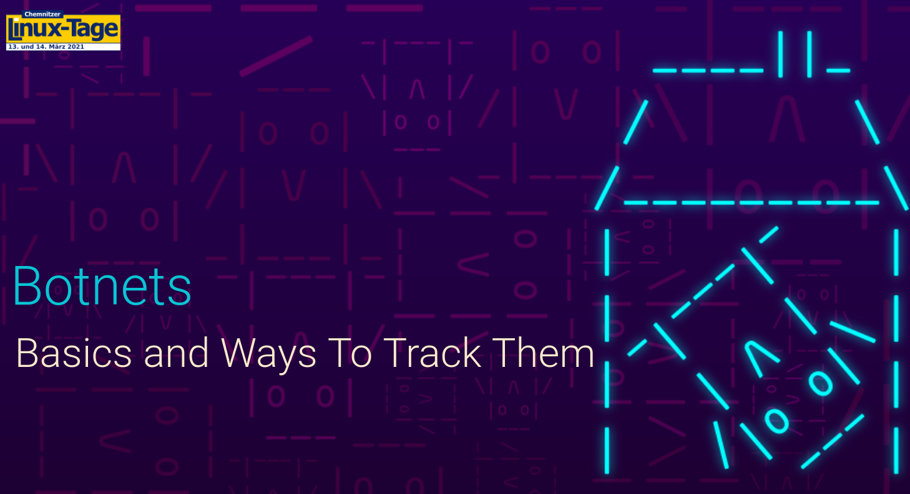

# Botnets - Basics and ways to track them

Slides of my presentation "Botnets - Basics and Ways to track them" at the Chemnitzer Linux-Tage 2021

* [Slides as PDF](%5BTALK_SLIDES%5D%20CLT_2021_botnets_basics_and_ways_to_track_them.pdf)
* [Talk on Youtube](https://www.youtube.com/watch?v=uSoDobmWtNU)

